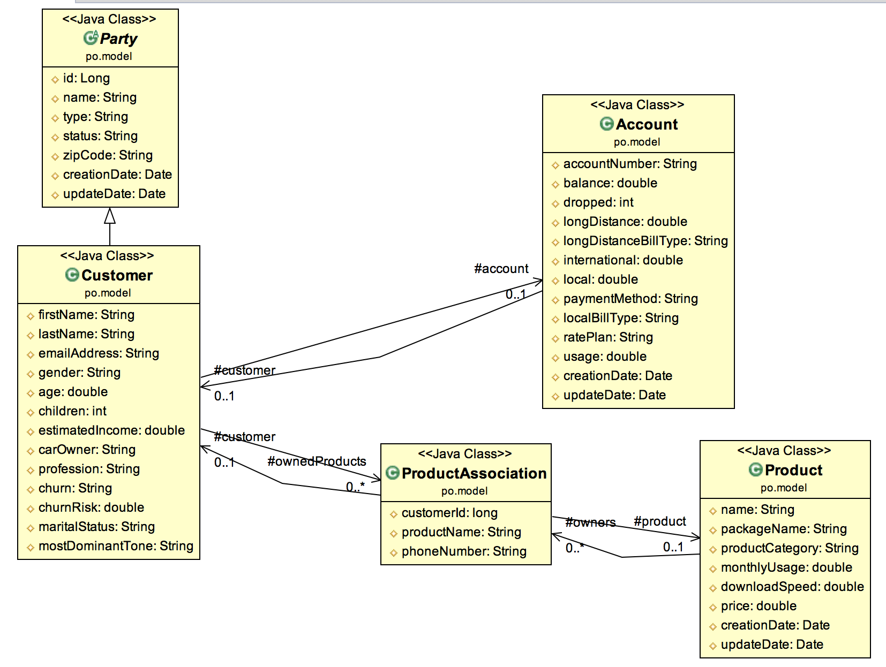
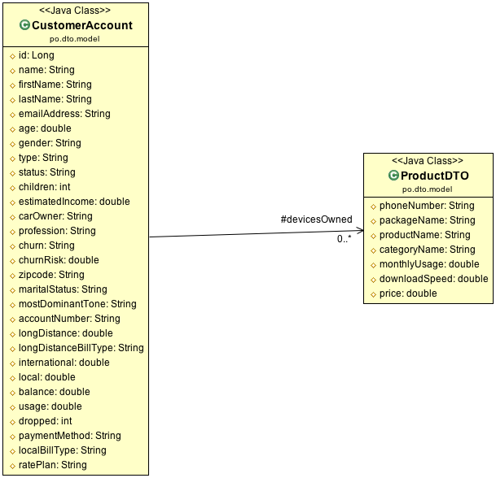
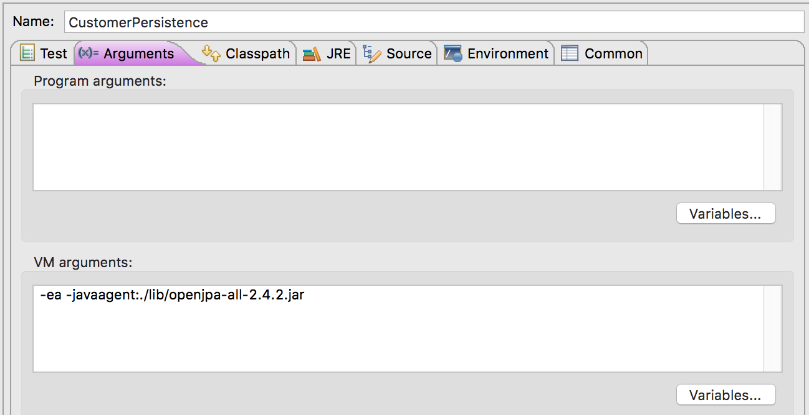
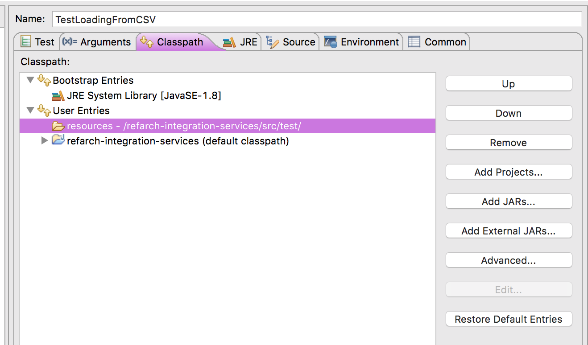
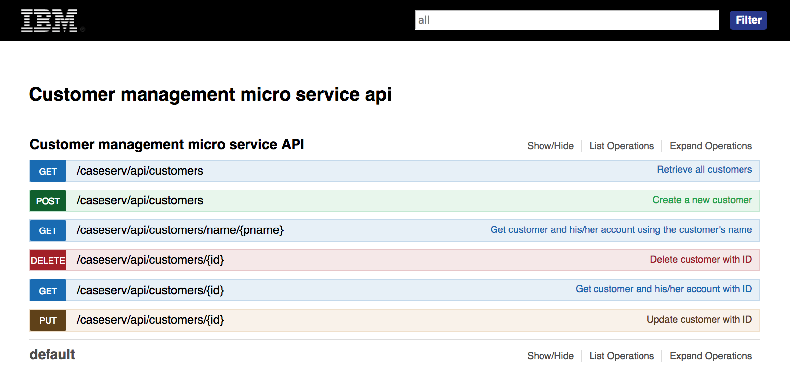

# Customer Management Microservice
This project is part of the 'IBM Data Analytics Reference Architecture' solution, available at [https://github.com/ibm-cloud-architecture/refarch-analytics](https://github.com/ibm-cloud-architecture/refarch-analytics) and the specific Customer churn solution described in [refarch-cognitive-analytics public github](https://github.com/ibm-cloud-architecture/refarch-cognitive-analytics) and hybrid cloud integration [solution](https://github.com/ibm-cloud-architecture/refarch-integration).

Updated 8/21/2018.

The goal of this project is to implement a set of RESTful services to manage customer, account, owned products and purchase order. The data persisted in DB2 include around 3500 fake customer records to serve as a training and test sets for churn risk scoring model.  

## Target audience
* Architects who want to understand the components involved and the architecture constraints and design considerations
* Developers who want to get starting code for RESTful app on WebSphere Liberty, and educate themselves on the related technologies:  Data Access Object Pattern, Data Transfer Object pattern, and Java Persistence Management. We are addressing packaging as docker image and define helm chart for IBM Cloud Private and kubernetes cluster deployment

# What you will learn
* Implement REST api using JAXRS annotation, document the API with swagger annotations
* Use gradle to compile, test, package the application
* Deploy to standalone liberty server, but also as docker image to IBM Cloud Private

# Table of Contents
* [Requirements](#requirements)
* [Code explanation](#code-explanation)
* [API management](#api-definition)
* [Build and deploy](#build-and-deploy)
* [Install on ICP](#ibm-cloud-private-deployment)
* [DB2 Creation](docs/DB2Creation.md)
* [Extract Load Data to DB2 Warehouse](docs/db2-to-db2warehouse.md)

# Requirements
The requirements are quite simple: support the creation, update, read and delete of customer records. Customer has one account and own products (telecom products but could be any type of product).
The purchase order is not fully implemented yet. It may evolve in future if we want to demonstrate analytics capabilities on product recommendations.

# Code Explanation
This microservice is using JAX-RS to expose RESTful APIs for all the basic operations on the customer and account entities. There are a lot of articles on how to develop a RESTful application using JAXRS, we will not rewrite everything, but we still want to present the steps we followed, so they can be used as a cheat sheet for your own development.

## Application
A JAX-RS application has a set of resources defined. Here we have CustomerResource, AccountResource and PurchaseOrderResource. See the class RAIntegrationApplication:
```java
@ApplicationPath("/caseserv")
@SwaggerDefinition(tags= {@Tag(name = "Customer API",description=" JAX-RS API for customer management microservice")})
public class RAIntegrationApplication extends Application {

	@Override
	public Set<Class<?>> getClasses() {
		Set<Class<?>> classes = new HashSet<Class<?>>();
		classes.add(CustomerResource.class);
		classes.add(PurchaseOrderResource.class);
		classes.add(AccountResource.class);
		classes.add(ProductResource.class);
		return classes;
	}
}
```
By default JAX-RS instantiates the resource classes per HTTP request. You will use singleton if you need to keep state or your resource is expensive. The JPA entity manager factory is an expensive object, but it is managed by itself as a singleton. So in most use case you do not need to have a Resource as a singleton.

The `@ApplicationPath` is an annotation from JAX-RS to specify the root context of the web application.

The Purchase Order may be externalize to a separate microservice, as only the customer id and product ids are needed during the creation of an order. Even if the data base is the same the logic and ownership of this logic may be different than the customer one. So a good candidate to move to a new microservice.

### Customer resource
Created a Customer resource Java class and add JAXRS annotations to define the URL paths and the swagger documentation:
 ```java
@Path("/customers")
@Api("Customer management microservice API")
	public class CustomerResource {
	   //...
	  @GET
		@Path(value="/{id}")
		@ApiOperation(value = "Get customer and his/her account with ID")
		@Produces(MediaType.APPLICATION_JSON)
		@ApiResponses({ @ApiResponse(code = 200, message = "Customer retrieved", response = CustomerAccount.class),
			@ApiResponse(code = 404, message = "Customer not found") })
		public Response getCustomerById(@PathParam("id")long id) throws DALException{
			logger.warning((new Date()).toString()+" Get Customer "+id);
				Customer c = customerService.getCustomerById(Long.parseLong(id));
				if (c != null) {
					return Response.ok().entity(new CustomerAccount(c)).build();
				} else {
					return Response.status(Status.NOT_FOUND).build();
				}
    }
		  // ... other operations not shown
	}

  ```
The `@GET, @Path and @PathParam` annotations are from JAX-RS. The `@Api, @ApiOperation, @ApiResponse` are from swagger, for API documentation purpose.

To automatically generate the swagger file you need the following swagger-annotation jar in your classpath (we deliver one in the lib folder) and use the `@Api, @ApiResponse, @ApiOperation` annotations. When deploying on Liberty server the swagger is autogenerated during the App deployment

The app is packaged and exposed with a web context set to `caseserv`. The web.xml map the URL: `/api/v1/*` to the servlet managing the resources.  Therefore the customer resource will be at the url: `http://hostname:port/caseserv/api/v1/customers`.

The above annotations exposes the method getCustomerById to a HTTP GET on the above URL with the customer id as suffix. The chosen implementation is to use the Response object to control return code and the payload. We could have returned the Customer data directly too.

Also we are not exposing the Customer object as is: the Customer is a JPA entity mapped to a CUSTOMER table in the database, we want to build a view of the data needed by the consumers of the service. The CustomerAccount is a Data Transfer Object pattern. This is a good practice to assess what consumer needs in term of data. It may not be the best view but we may refactor it later when requirements will add up.

The resource class is really dedicated to support Annotation and to return HTTP object. The business and integration logic is done within the CustomerService class. This class will be easier to unit test, and can be reused by other resource if needed.

### Data model
The entity data model to support is presented in the figure below. It is similar to the tables in backend database. The java classes have JPA annotations to control the persistence and management of the relationship, persistence strategy and loading strategy.

 

 The CustomerAccount data transfer object is a view of the persistence model. It does not present a best practice, but it is good enough from now.

 

We also delivered SQL statements and scripts to create the database in DB2. See the folder `db-scripts`.


### Web app descriptor
The web.xml specifies the url mapping to the pre-defined servlet serving REST resources:
```xml
<servlet>
 <description>
 Main servlet entry point for the REST resource/application</description>
 <servlet-name>JAX-RS Servlet</servlet-name>
 <servlet-class>com.ibm.websphere.jaxrs.server.IBMRestServlet</servlet-class>
 <init-param>
   <param-name>javax.ws.rs.Application</param-name>
   <param-value>ibm.ra.customer.RAIntegrationApplication</param-value>
 </init-param>
 <load-on-startup>1</load-on-startup>
 <enabled>true</enabled>
 <async-supported>false</async-supported>
</servlet>
<servlet-mapping>
 <servlet-name>JAX-RS Servlet</servlet-name>
 <url-pattern>/api/v1/*</url-pattern>
</servlet-mapping>
```

### Data Access Object Classes

Those classes implement the DAO pattern to access the database. We are using a pure Java Persistence API implementation. We defined a BaseDAO for generic persistence operations like save, update, delete... Then each DAO supports a specific entity and its CRUD operations.
The following code example illustrates a typical JPA pattern of using predefined named query at the entity level:

```
@Entity(name="Customer")
@Table(name="CUSTOMERS")
@NamedQuery(name="Customer.findAll", query="SELECT c FROM Customer c")
public class Customer extends Party{
```
In the DAO implementation for the "get the list of customers" method, we use the JPA entity manager and create an instance of the query:

```
@Override
public Collection<Customer> getCustomers() throws DALException {
  EntityManager em = getEntityManager();
  List<Customer> results = new ArrayList<Customer>();
  try{
    Query query =em.createNamedQuery("Customer.findAll");
    results = query.getResultList ();

  } finally {
    em.close();
  }
  return results;
}
```
The Customer to account is a one to one relationship and an account could not live without a customer so when a new customer is created the account is persisted via the cascade strategy.
For the customer to owned products the situation is not the same. We want to avoid using the product DAO inside the customer DAO. So the integration will be done in the service level, the CustomerService class. We will discuss this approach in the next [TDD](#test-driven-development) section.

## Test Driven Development
As part of our development methodology we are using since 2003, we develop by starting by the tests. So the `src/test/java` folder includes a set of package to unit test each of the application layer: DAO, service.

To unit test the DAO we are using Derby Embedded, which is compatible with DB2, and uses in memory database. So it is very easy to set up data for testing and delete the database at the tests completion. The class BaseTest is defining one `AfterClass` method to delete the DB.
Each DAO has at least one unit test class implemented using [junit](http://junit.org).

### Validating DAO / JPA
To implement the DAO we start by specifying the DAO interface  and then implemented the unit tests for each method, before coding the JPA code. The junit tests are in the package `dao.jpa.ut` under the folder `src/test/java`.

The test has a specific persistence configuration that uses derby embedded so it is easy to delete the DB after each test class. The persistence.xml is under `src/test/resources/META-INF` folder.
```xml
<persistence-unit name="customer" transaction-type="RESOURCE_LOCAL">
 <provider>org.apache.openjpa.persistence.PersistenceProviderImpl</provider>
   <class>po.model.Party</class>
   <class>po.model.Customer</class>
   <class>po.model.Account</class>
 <properties>
 <property name="javax.persistence.jdbc.driver" value="org.apache.derby.jdbc.EmbeddedDriver"/>
```
The `BaseTest` has an AfterClass method to delete the database.

When running the test in Eclipse, be sure to add to the vm arg of each test, the following `-javaagent:./lib/openjpa-all-2.4.2.jar` to get the entities JPA enhanced. The figure below presents the setting in eclipse `run configuration`:  



Also as we are using a dedicated `persistence.xml` to use derby for unit testing, it is important to modify the classpath of the `run configuration` and reference the test resource folder: select the `User Entries`, then `Advanced` button, select `Add folders`, and select test `src/test/resources` folder, then finally be sure it is above the default classpath, using `Up` button to change the order.  



### Populating Customer database
When connected to the test or staging platform it is recommended to use our data sets to prepare data for the machine learning / analytics future work and to demonstrate the application. The folder `dataset` has two csv files with customer records. The customer.csv has 10 records, it should be used to validate the deployment, and everything works fine. The customer_churn.csv has all the remaining records.

For the other use case validation we have two java programs to be executed in this order:
* AddProductsToBackend: create basic products to be use as smartphone
* AddNeededCustomersToBackend: add Eddie and Bob for demonstration purpose.

You need to have direct access to the Database server and run the service in docker with the command:
```
$ docker run -p 9080:9080 ibmcase/customerms
```
Accessing the following the following URL should give you the created user data:
On your localhost:
http://localhost:9080/caseserv/api/v1/customers/1
or
http://localhost:9080/caseserv/api/v1/customers/email/bobbuilder@email.com

The web app of [this repository](https://github.com/ibm-cloud-architecture/refarch-cognitive-analytics) is the front end to access those data.

## API definition
With Liberty it is possible to visualize the API definition for a deployed JAXRS resource. The product documentation is [here](https://www.ibm.com/support/knowledgecenter/en/SSAW57_liberty/com.ibm.websphere.wlp.nd.multiplatform.doc/ae/twlp_api_discovery.html), but to summarize we did two things:
* define a yaml file for the swagger and save it to webapp/META-INF/stub folder.
* modify the server.xml to add api discovery feature.
```
        <feature>apiDiscovery-1.0</feature>
```

Once the service is deployed locally or on remote server, you can access the swagger by going to the URL http://localhost:9080/api/explorer/#/Customer_management_micro_service_API will display the API as you can see below:



We also developed a `swagger.yaml` file in the folder `src/main/webapp/META-INF/stub` to describe the APIs. This may be helpful for defining an API product in API Connect.

As Liberty supports generation of swagger by leveraging annotations in resources classes and the ApiDiscovery feature.

## Build and Deploy

### DB2 CUSTDB database
For the DB2 customer database creation see [this note for details](docs/DB2Creation.md)

### Microservice Java Code
The project was developed with [Eclipse Neon](http://www.eclipse.org/neon) with the following plugins added to the base eclipse:
* Websphere Developer Tool for Liberty: using the Marketplace and searching WebSphere developer, then use the Eclipse way to install stuff.
* Gradle eclipse plugin

Install `gradle CLI` on your computer so you can build, unit test and assemble war.  For that see the installation instructions at [gradle](http://gradle.org)

To build the code you can use maven `nvm install` or gradle: `./gradlew build`. The `build.gradle` script should compile, unit tests and build a war under `build/libs` folder.

We have developed a simple script to do all the operations and update the version number for helm charts and docker tag. The command takes a unique argument: the version number. If no number is provided it uses the one in the `values.yaml`.
```
$ ./build.sh 0.0.6
```

### Dockerize
Then use the `docker build -t ibmcase/customerms .` command to build a docker image which includes WebSphere liberty, the server configuration, and the war file pre deployed in the app folder.

You can test locally using `docker run -p 9080:9080 ibmcase/customerms` and then points your web browser to `http://localhost:9080/caseserv/index.html`. If the front end page is loaded your configuration works!.

We also added some integration tests under the package `ibm.caseserv.itests` folder.

## IBM Cloud Private deployment
We are following the same approach as the other microservice deployment we do at http://github.com/ibm-cloud-architecture, for example the [Case web app](https://github.com/ibm-cloud-architecture/refarch-caseinc-app/blob/master/docs/icp/README.md) or the [Data Access layer service](https://github.com/ibm-cloud-architecture/refarch-integration-inventory-dal/blob/master/docs/icp/README.md) projects.
The steps can be summarized as below:
* dockerize the application with Liberty: a Dockerfile is delivered as part of this project. See previous section: `docker build -t ibmcase/customerms .``
* If you use private docker repository within ICP, tag the docker images with the name of the remote docker repository, the target namespace and the name and version of the image. For example: `greencluster.icp:8500/greencompute/customerms:v0.0.1`
 * docker login to remote repo: `docker login greencluster.icp:8500`
 * docker push the newly created image to the remote repository: `docker push greencluster.icp:8500/greencompute/customerms:v0.0.1`
* As we use the public dockerhub repository we docker login and use docker push:
 ```
 $
 ```
* One time only: define helm charts with deployment configuration: the chart definition is under chart/green-customerms
* login to the remote cluster: `bx pr login -u admin --skip-ssl-validation -a https://172.16.40.130:8443`
* use `helm` CLI to deploy the helm chart and work on the deployed pod.
```
$ helm list --tls
$ helm del --purge green-customerms --tls
# under the chart folder
$ helm install green-customerms/ --name green-customerms --namespace greencompute --tls
```

In case of problem we are centralizing the troubleshooting in [this note](https://github.com/ibm-cloud-architecture/refarch-integration/blob/master/docs/icp/troubleshooting.md).
